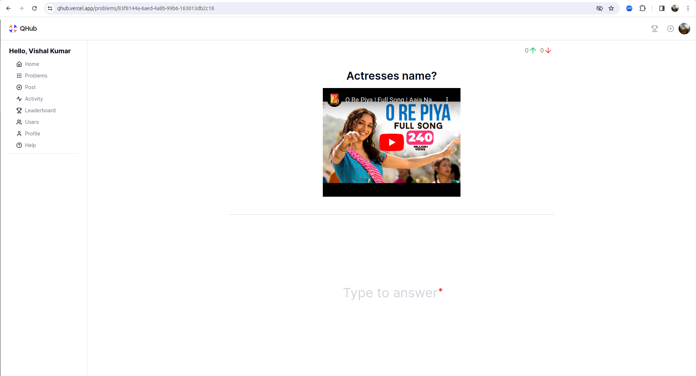

QHub is a question and answer application. It gives user ability to post problem on any topic using `markdown`, `svg`, `latex`, `html`, `css`, `text`, `audio`, and `vedio`.

<b>Application url</b> - [QHub](https://qhub.vercel.app), 


`https://qhub.vercel.app`

## Pages

### Home Page


### Problems Page


### Problem Details Page





### Post Page


### Activity Page


### Activity Details Page


### Leaderboard Page


### Profile Page


## Tasks

### Loading Page
- Implement loading page :heavy_check_mark:
  - TODO: improve loading UI using `Skeleton`

### Home Page

- Implement home page :hourglass_flowing_sand:

### Problems Page

- Implement problem details page. :hourglass_flowing_sand:

### Post Page

- Implement post page. :heavy_check_mark:
- Implement server action to create problem. :heavy_check_mark:
- Implement `problem`` service. :heavy_check_mark:
- Implement `activity` service. :heavy_check_mark:

### Activity Page

### Leaderboard Page

### Users Page

### Profile Page

- Display profile image and full name :heavy_check_mark:

## Data Model

- Identify entities involved :heavy_check_mark:
- Update entities and relationship in `schema.prisma` :heavy_check_mark:
- Generate and push the changes. :heavy_check_mark:

## TODO

- Update clerk endpoint for production deployment.

## Setup

- Add `shadcn/ui` using `npx shadcn-ui@latest init`
- Testing
  - Jest
    - `npm install -D jest jest-environment-jsdom @testing-library/react @testing-library/jest-dom`
    - `npm init jest@latest`
    - `npm install -D ts-node`
    - `npm install --save-dev @jest/globals`
- Authentication
  - Install `clerk` using `npm install @clerk/nextjs`
- Database setup
  - Install `prisma` using `npm install -D prisma`
  - Install prisma client using `npm install @prisma/client`
  - Init prisma `npx prisma init`
  - Use `npx prisma db push` to push new changes followed by `npx prisma generate`
  - Use `npx prisma studio` to view data
- ngrok
  - `ngrok http --domain=amoeba-suited-basically.ngrok-free.app 3000`
- Webhooks
  - Install `svix` using `npm install svix`


## Getting Started

First, run the development server:

```bash
npm run dev
# or
yarn dev
# or
pnpm dev
# or
bun dev
```

Open [http://localhost:3000](http://localhost:3000) with your browser to see the result.

You can start editing the page by modifying `app/page.tsx`. The page auto-updates as you edit the file.

This project uses [`next/font`](https://nextjs.org/docs/basic-features/font-optimization) to automatically optimize and load Inter, a custom Google Font.

## Learn More

To learn more about Next.js, take a look at the following resources:

- [Next.js Documentation](https://nextjs.org/docs) - learn about Next.js features and API.
- [Learn Next.js](https://nextjs.org/learn) - an interactive Next.js tutorial.

You can check out [the Next.js GitHub repository](https://github.com/vercel/next.js/) - your feedback and contributions are welcome!

## Deploy on Vercel

The easiest way to deploy your Next.js app is to use the [Vercel Platform](https://vercel.com/new?utm_medium=default-template&filter=next.js&utm_source=create-next-app&utm_campaign=create-next-app-readme) from the creators of Next.js.

Check out our [Next.js deployment documentation](https://nextjs.org/docs/deployment) for more details.
